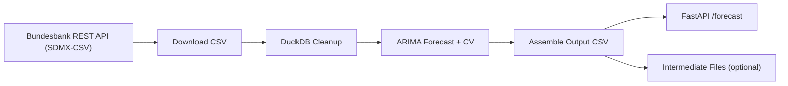
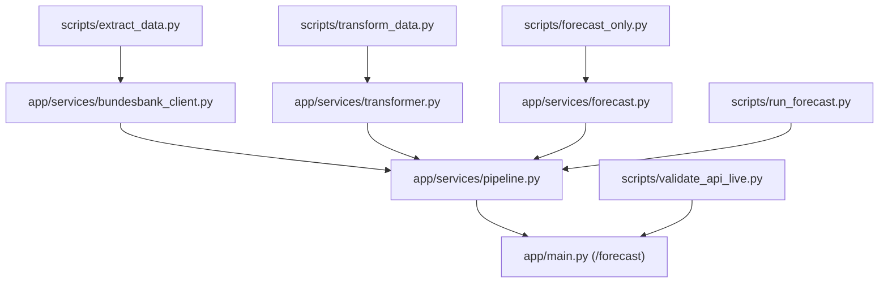

# Zinskompass Forecast API

POC and exploration for rapid agentic prototyping using OpenAI Codex. This was built in 4 prompts, with a total cost of ~75k tokens using the GPT-5.3-Codex Extra High model, and took about 40 minutes end-to-end (including documentation).


FastAPI service that pulls the Bundesbank time series **BBIN1.M.D0.ECB.ECBMIN.EUR.ME**, cleans it with DuckDB, and produces a 12-period univariate forecast. The output is a single CSV table with actuals (`ACT`) followed by forecasts (`FCT`).

## Cost And ROI (Rough Estimate)

Assumptions:
- OpenAI pricing (gpt-5.2-codex): $1.75 / 1M input tokens, $0.175 / 1M cached input tokens, $14.00 / 1M output tokens.
- Token split: 75k total tokens, assumed 50% input / 50% output, with 50% of input cached.
- Exchange rate: 1 EUR = 1.1855 USD (assumption for calculation).
- Labor rate: EUR 100/hour.

Estimate:
- Token cost: ~EUR 0.47.
- Operator time: ~1 hour -> EUR 100.
- AI-assisted total: ~EUR 100.47.

Traditional build estimate:
- 1 engineer, ~4 working days (32 hours) -> ~EUR 3,200.

Economic impact:
- Cost reduction: ~EUR 3.1k saved.
- Productivity gain: ~32x faster (32 hours -> 1 hour).
- Cost efficiency: ~32x cheaper (EUR 3,200 -> EUR 100.47).

## Architecture (High Level)



## Architecture (Plumbing)



## What It Does

1. Downloads the full time series from the Bundesbank REST API (SDMX-CSV).
2. Removes metadata and normalizes the time/value columns using DuckDB in-memory.
3. Fits a univariate ARIMA model with rolling-forward cross-validation to pick `(p, d, q)`.
4. Produces a 12-period out-of-sample forecast from the latest observation.
5. Returns a CSV with `timestamp`, `value`, `type`, `lower`, `upper` (confidence bands on forecasts), plus metadata columns (`meta_*`) for model details and source info.

## Run Locally

```bash
python3 -m venv .venv
source .venv/bin/activate
pip install -r requirements.txt

uvicorn app.main:app --reload
```

Then call:

```bash
curl -s http://localhost:8000/forecast
```

## Containerized

```bash
docker build -t zinskompass-api .
docker run -p 8000:8000 zinskompass-api
```

## Environment Variables

- `BUNDESBANK_LOCAL_CSV`: Path to a local CSV file to use instead of downloading.
- `CACHE_BB_DOWNLOAD`: Set `true` to write downloaded data into `data/cache/`.
- `WRITE_INTERMEDIATE`: Set `true` (default) to write `raw.csv`, `clean.csv`, `forecast.csv`, `output.csv`, and `model_metadata.json` into `data/cache/`.
- `ALLOW_SAMPLE_FALLBACK`: Set `true` to allow using the sample CSV if download fails.
- `BUNDESBANK_TIMEOUT`: HTTP timeout in seconds (default `30`).

## Debug Pipeline

```bash
python3 scripts/run_forecast.py --horizon 12
```

## Step-by-Step Scripts

```bash
python3 scripts/extract_data.py --output data/cache/raw.csv
python3 scripts/transform_data.py --output data/cache/clean.csv
python3 scripts/forecast_only.py --horizon 12
```

## Validate API (uses sample CSV)

```bash
python3 scripts/validate_api.py
```
