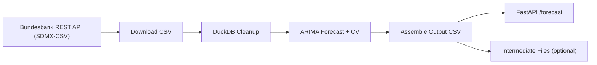
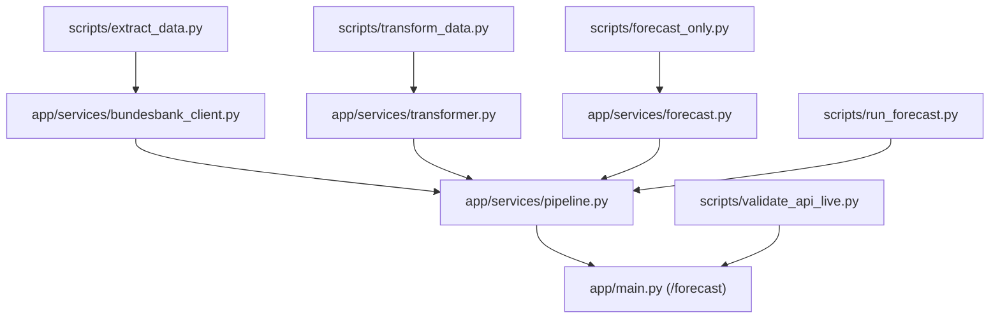

# Project Walkthrough

This document explains how the project was built, what each part does, and how the data flows from the Bundesbank API to the final CSV output.

## High-Level Goal

Build a containerized FastAPI service that:
1. Downloads the Bundesbank time series `BBIN1.M.D0.ECB.ECBMIN.EUR.ME`.
2. Cleans it using DuckDB in-memory.
3. Fits a univariate ARIMA model with rolling-forward cross-validation.
4. Forecasts 12 periods ahead (out-of-sample).
5. Returns a CSV containing actuals + forecast + confidence bands + model metadata.

## Architecture Diagrams

### API Flow (High Level)



### Plumbing (Python Files)



## Repository Structure

- `app/`
  - `main.py`: FastAPI app with `/forecast` endpoint.
  - `config.py`: All runtime settings (API base, series ID, cache flags).
  - `services/`
    - `bundesbank_client.py`: Fetches the CSV (SDMX-CSV REST API, fallback to direct download if needed).
    - `transformer.py`: Parses the raw CSV and normalizes timestamp/value using DuckDB.
    - `forecast.py`: Rolling-forward CV to select ARIMA order and generate forecast + confidence bands.
    - `pipeline.py`: Orchestrates download -> transform -> forecast -> output, and writes intermediates.
- `scripts/`
  - `extract_data.py`: Download-only helper.
  - `transform_data.py`: Download + transform helper.
  - `forecast_only.py`: Download + transform + forecast helper.
  - `run_forecast.py`: Full pipeline helper.
  - `validate_api_live.py`: End-to-end validation script with detailed logs.
- `data/cache/`: Intermediate files (`raw.csv`, `clean.csv`, `forecast.csv`, `output.csv`, `model_metadata.json`).
- `Dockerfile`: Container build with `python:3.11-slim`.
- `requirements.txt`: Dependency pinning.

## Step-By-Step Build Logic

### 1) Download
- Implemented in `app/services/bundesbank_client.py`.
- Primary source: Bundesbank SDMX REST CSV endpoint using the official REST API format.
- Fallback: Bundesbank direct CSV download endpoint (same series).
- Controlled by environment variables in `app/config.py`.

### 2) Extraction
- The CSV includes metadata columns and can include a BOM + `;` delimiter.
- `app/services/transformer.py` detects header rows, handles delimiter differences, and parses timestamps and values.
- DuckDB is used in-memory to normalize timestamps and numeric values.

### 3) Transformation
- Output from `transformer.load_time_series()` is a clean DataFrame with:
  - `period` (pandas PeriodIndex)
  - `value` (float)
- Duplicate or malformed rows are removed.

### 4) Forecast
- Implemented in `app/services/forecast.py`.
- Steps:
  1. Stationarity check with ADF, automatic differencing (`d`).
  2. Rolling-forward CV to choose `(p, d, q)` based on RMSE.
  3. Fit ARIMA on full series.
  4. Forecast 12 periods ahead + confidence intervals.
- Metadata captured: order, AIC, BIC, LLF, nobs, CV RMSE, horizon.

### 5) Output Assembly
- Implemented in `app/services/pipeline.py`.
- Actuals are tagged as `ACT`, forecasts as `FCT`.
- Confidence bands are added in `lower` / `upper`.
- Metadata is injected as `meta_*` columns (same values on every row).

### 6) Intermediates
- If `WRITE_INTERMEDIATE=true`, the pipeline writes:
  - `data/cache/raw.csv`: raw download
  - `data/cache/clean.csv`: normalized series
  - `data/cache/forecast.csv`: forecast + confidence intervals
  - `data/cache/output.csv`: final API output
  - `data/cache/model_metadata.json`: model details

## Running Locally

```bash
python3 -m venv .venv
source .venv/bin/activate
pip install -r requirements.txt
uvicorn app.main:app --reload
```

Then:

```bash
curl -s http://localhost:8000/forecast
```

## Running In Docker

```bash
docker build -t zinskompass-api .

# Mount cache folder to persist intermediate outputs
mkdir -p data/cache

docker run --rm -p 8000:8000 \
  -e WRITE_INTERMEDIATE=true \
  -e CACHE_BB_DOWNLOAD=true \
  -v $(pwd)/data/cache:/app/data/cache \
  zinskompass-api
```

## Output Format

The CSV returned by `/forecast` looks like this:

```
timestamp,value,type,lower,upper,meta_order,meta_aic,meta_bic,meta_llf,meta_nobs,meta_cv_rmse,meta_horizon,meta_source_ts_id,meta_source_url,meta_generated_at_utc
1999-01,3.0,ACT,,,2,1,1,...
...
2026-02,2.1485,FCT,1.87,2.42,2,1,1,...
```

- `ACT` rows have empty `lower/upper`.
- `FCT` rows include confidence bounds.
- `meta_*` columns repeat across all rows for easy downstream inspection.

## Why DuckDB
DuckDB allows us to reliably parse, filter, and cast values from the Bundesbank CSV without persisting anything to disk, keeping the pipeline fully in-memory.

## Why ARIMA + Rolling CV
ARIMA is a simple, interpretable baseline for univariate time series. Rolling-forward CV provides a more realistic estimate of out-of-sample error when selecting parameters.
